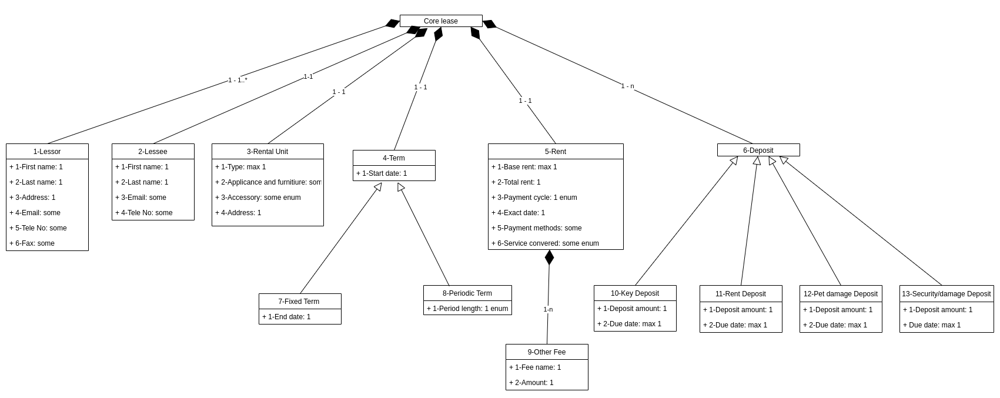

# Annotation Schema 

To annotate the forms in natural language based on the core ontology, we give specific number to each attribute in the core ontology.

>  For example, number "1.3" means Lessor.Address . 
