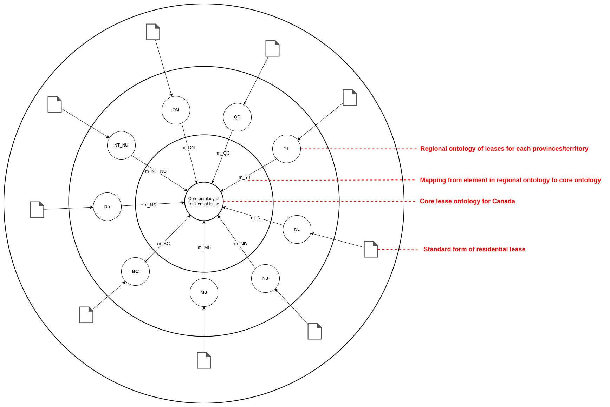
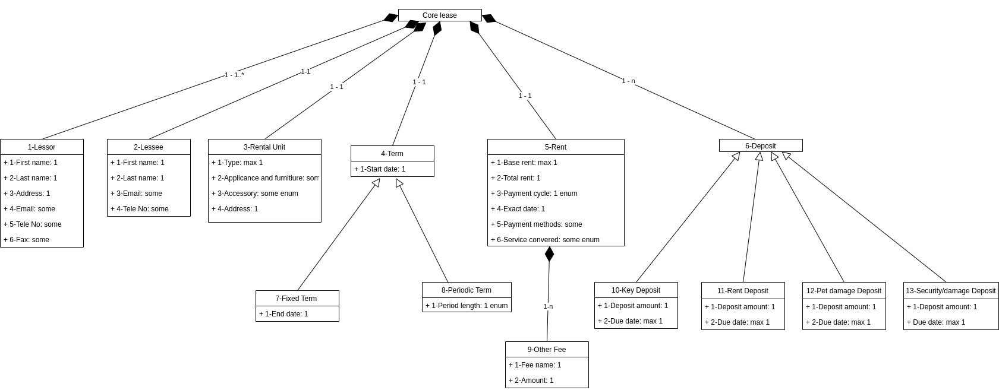
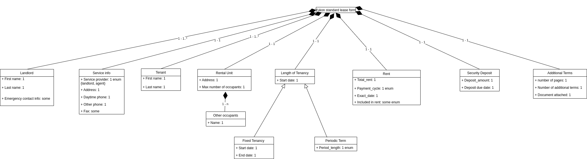
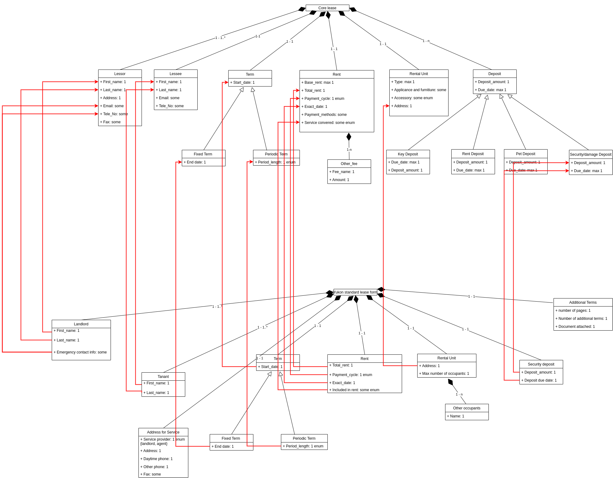
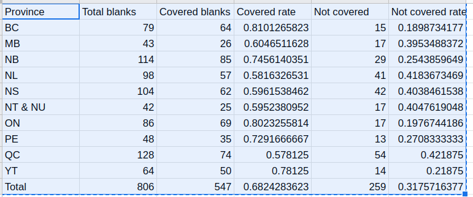
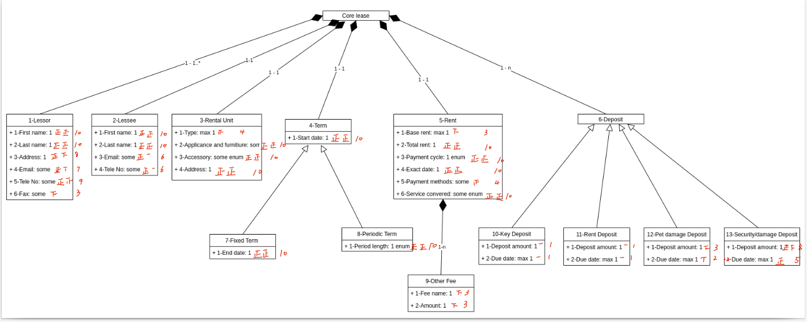

# Lease ontology over Canada

The 2-level ontology for residential leases is class diagram in xml format, built with drawio. You can open this xml in (https:draw.io). 

The "Lease_class_diagram" contains the ontologies and the mapping between national and regional ontology.

- File "Core.xml": The core ontology for residential leases over CA
    - 
- Dir "Regional": The regional ontologies for each province or territory
    - 
- Dir "mapping": mapping files which maps components in regional ontologies to the core ontology
    - 
- Dir "Std_lease_form" directory contains the standard forms provided by local governments.
    - As far as we know, Almost all provinces/territories' government provide standard forms for tenancy agreement except Alberta and Sasckatoon, while Nunavut territory and North teeritory use same standard forms. In this end, there are ten standard forms of residential leases
- Dir "Doc" contains all description of each regional and national ontologies 
    - In file "./Doc/0_Core.md", we specifed the definition for each section and the explain the meaning for each attribute. 

## Core ontology for rental agreement 
To verify the content in lease forms, this ontology must cover all components that we need in verification while achieve the balance of Completeness and Conciseness. 

## Core ontology evaluation 

### Evaluate the completeness of the core ontology 

To measure the completeness of the core ontology, we mapped standard forms to the core ontology, while calculating How many blanks in standard forms can be mapped to core ontology. 

> Blank definition: "blank" means the blank that need to be filled by user in a form of tenancy agreement. We consider:
> (1: the blanks related to 1 address as 1 blank. For example, {"commmunity address" + "city" + "province" + "postcode"} is ONE blank. (2: the blanks related to 1 date as 1 blank.For example, {"day" + "month" + "year" } is ONE blank. 

$$ 
Completeness = (number\; of\; blanks\; can\; be\; mapped\; in\; form) /(total\; number\; of\; all\; blanks)
$$

#### Result 

Based on our [annotation schema](./Annotated_data/Annotation_schema.md), we mapped these 10 standard forms to core ontology, the raw annotated forms are in floder "./Annotated_data/Tagged_forms_completeness". As a result: 
The stastics can be seen on Google sheet: https://docs.google.com/spreadsheets/d/1d9V9sKLqNrN79dEv0dDgsItOMSIJtcV8vJ_Jf8dGjdQ/edit#gid=0

The result listed above indicates that the core ontology can cover average 68.24% of all standard forms for tenancy over 11 provinces/territories in Canada. 

### Evaluate the conciseness of the core ontology 

To measure the conciseness of the core ontology, for each attribute in core ontology, we calculate the frequency that this attribute appears in standard lease forms. 

#### Result 

By calculating how many forms (out of ten standard forms) mapped to each attribute in the core ontology

The stastics can be seen on Google sheet: https://docs.google.com/spreadsheets/d/1d9V9sKLqNrN79dEv0dDgsItOMSIJtcV8vJ_Jf8dGjdQ/edit#gid=0

