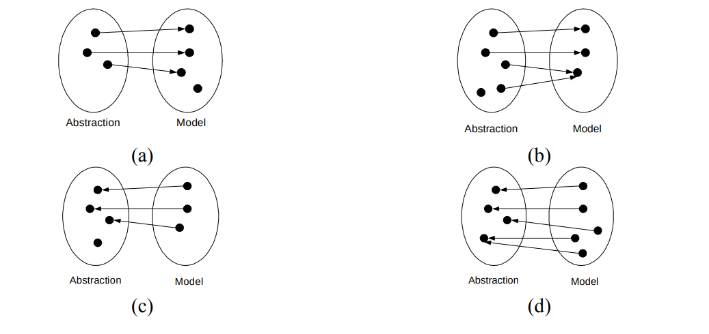

## Steps to evaluate test forms of leases 

4 metrics: 
- a:Lucidity: mapping from abstraction(core ontology) to model(test form of leases). Every construct in the model represent at most 1  concept of the domain abstraction.  A construct overload occurs when a single language construct is used to represent two or more domain concepts.
- b:Soundness: every construct in the model M represents at least one (although perhaps several) concept of the domain abstraction A Construct excess occurs whena language construct does not represent any domain concept
- c:Laconicity: every concept in the abstraction A is represented by at most one (although perhaps none) construct in the representation Construct redundancy occurs when more than one language construct can be used to represent the same domain concept.
- d:Completeness: each concept in a domain abstraction (instance of the domain conceptualization) is represented by at least one (although perhaps many) construct in the representation M    
    
    